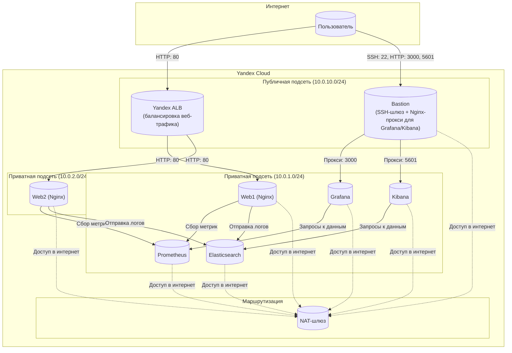

# Курсовая работа на профессии "DevOps-инженер с нуля" - Старцев Данила Антонович

## Содержание

1. [Задача](#задача)
2. [Инфраструктура](#инфраструктура)
   - [Сайт](#сайт)
   - [Мониторинг](#мониторинг)
   - [Логи](#логи)
   - [Сеть](#сеть)
   - [Резервное копирование](#резервное-копирование)
3. [Архитектура и принятые решения](#архитектура-и-принятые-решения)
   - [Сетевая структура и состав ВМ](#сетевая-структура-и-состав-вм)
   - [Сервисная модель](#сервисная-модель)
   - [Принятые компромиссы](#принятые-компромиссы)
4. [Используемые технологии](#используемые-технологии)
5. [Структура проекта](#структура-проекта)
6. [Визуальная архитектура проекта](#визуальная-архитектура-проекта)
7. [Развёртывание](#развёртывание)
8. [Доступ к сервисам](#доступ-к-сервисам)
9. [Выводы](#выводы)
10. [Полезные команды](#полезные-команды)

---

## Задача

Разработать отказоустойчивую инфраструктуру для простого сайта в Yandex Cloud, включающую:

- балансировку нагрузки и отказоустойчивость;

- мониторинг (метрики серверов и Nginx);

- сбор и хранение логов;

- регулярное резервное копирование данных;

- безопасность и экономичность.

Проект выполнен с учётом экономии облачных ресурсов (прерываемые ВМ, IaC, минимальный набор публичных IP).

Перед началом работы над курсовым заданием изучена [Инструкция по экономии облачных ресурсов](https://github.com/netology-code/devops-materials/blob/master/cloudwork.MD).

---

## Инфраструктура

Для развёртки инфраструктуры использованы **Terraform** и **Ansible**.

### Сайт
- Созданы две ВМ (`web1`, `web2`) в разных зонах доступности (`ru-central1-a`, `ru-central1-b`).
- На каждой ВМ развернут сервер Nginx в Docker-контейнере. ОС и содержимое ВМ идентичны.
- Использован набор статичных файлов для сайта.
- Балансировка нагрузки реализована с помощью **Yandex Application Load Balancer (ALB)** (вместо Nginx на Bastion). Это managed-решение, обеспечивающее отказоустойчивость и автоматическое распределение трафика между ВМ в разных зонах доступности.
- ALB настроен с Health Check на путь `/`, порт 80, интервал 10 секунд.
- Тестирование сайта выполнено через `curl -v http://<публичный IP ALB>:80`.

> **Скриншот демонстрации через браузер и curl:**  
> 
> 

### Мониторинг

- Создана ВМ (`prometheus`) для Prometheus.
- На каждой веб-ВМ установлены **Node Exporter** и **Nginx Log Exporter**.
- Prometheus настроен на сбор метрик с этих экспортеров.
- Создана ВМ (`grafana`) для Grafana.
- Grafana настроена на взаимодействие с Prometheus. Настроены дашборды с отображением метрик: Utilization, Saturation, Errors для CPU, RAM, дисков, сети, а также `http_response_count_total` и `http_response_size_bytes`. Добавлены необходимые пороговые значения (thresholds).

> **Скриншот дашборда Grafana:**  
> 
> 

### Логи

- Создана ВМ (`elasticsearch`) для Elasticsearch.
- На веб-серверах установлен Filebeat (в Docker-контейнере), настроена отправка access.log и error.log Nginx в Elasticsearch.
- Создана ВМ (`kibana`) для Kibana, сконфигурировано соединение с Elasticsearch.

> **Скриншот Kibana:**  
> 

### Сеть

- Развернут один VPC (`diplom-project-network`).
- Серверы web, Prometheus, Elasticsearch помещены в приватные подсети.
- Bastion является единственной точкой входа из интернета, поэтому он размещён в публичной подсети. Grafana и Kibana расположены в приватных подсетях, доступ к ним осуществляется через прокси на Bastion (порты 3000 и 5601).
- Для балансировки веб‑трафика между web‑серверами используется **Yandex Application Load Balancer (ALB)**, который также находится в публичной сети и имеет внешний IP.
- Настроены Security Groups для соответствующих сервисов с ограничением доступа только к необходимым портам:
  - Bastion: порты 22 (SSH), 3000 (Grafana), 5601 (Kibana) — доступ только с моего IP.
  - web‑серверы: порт 80 (от ALB), 9100 (Node Exporter), 4040 (Nginx Log Exporter) — доступ из внутренней сети.
  - Internal: разрешён весь внутренний трафик между ВМ.
- Реализована концепция bastion host для безопасного доступа к внутренним ресурсам.

### Security Groups

| Группа | Разрешённые порты | Источник | Назначение |
|--------|-------------------|----------|------------|
| `bastion` | 22 (SSH), 3000 (Grafana), 5601 (Kibana)| `77.222.115.109/32` | Доступ только с моего IP |
| `internal` | 22, ANY (внутренний трафик) | `10.0.0.0/16` | Взаимодействие между ВМ |
| `web` | 80 (от ALB), 9100 (Node Exporter), 4040 (Nginx Log Exporter) | `10.0.0.0/16` | Доступ к веб‑серверам и экспортёрам |

> **Важно:**в предыдущих версиях README ошибочно указывалось, что на Bastion открыт только порт 22. На самом деле для работы прокси к Grafana и Kibana нужны порты 3000 и 5601. Теперь описание полностью соответствует конфигурации.

### Резервное копирование

Настроена двухуровневая система резервного копирования:

**1. Локальное копирование на Bastion (pull-модель)**
- Каждую ночь в 2:00 на каждой ВМ (кроме Bastion) создаётся локальный бэкап критичных директорий: `/etc`, `/var/log`, `/opt` (исключая `/opt/backup`, `/opt/containerd`, `/opt/docker`, `/opt/prometheus`, `/opt/grafana`), `/home/ubuntu`.
- Бэкапы сохраняются в `/opt/backup/<hostname>/` с датой и временем.
- В 3:00 Bastion забирает эти бэкапы с помощью `rsync` (pull-режим) и сохраняет в своей `/opt/backup/<hostname>/`. После успешного копирования файлы удаляются с исходных ВМ.
- В 4:00 на Bastion выполняется очистка бэкапов старше 7 дней.

**2. Резервное копирование в Yandex Object Storage**
- Ежедневно в 5:00 на Bastion создаётся архив `/opt/backup` и загружается в бакет Object Storage.
- Бакет: `diplom-project-backup-<folder_id>`.
- Хранение — 7 дней, автоматическая очистка через lifecycle rule.
- Доступ через сервисный аккаунт `diplom-sa` со статическим ключом.

**Ручной запуск бэкапа в S3:**
```bash
sudo /usr/local/bin/s3_backup.sh
```
**Проверка бэкапов в бакете:**
```bash
aws s3 ls s3://diplom-project-backup-<folder_id>/ --endpoint-url=https://storage.yandexcloud.net
```

---

**Теперь рассмотрим архитектурные решения, которые легли в основу проекта**

## Архитектура и принятые решения

Визуальная схема взаимодействия компонентов системы представлена в разделе [Визуальная архитектура проекта](https://github.com/MindMaze74/diplom-project/blob/main/README.md#визуальная-архитектура-проекта).

### Сетевая структура и состав ВМ

- Создан один VPC с двумя зонами доступности.
- В каждой зоне имеются публичная подсеть (для Bastion) и приватная подсеть (для всех остальных сервисов).
- Для доступа в интернет из приватных подсетей настроен NAT-шлюз.
- Security Groups настроены по принципу минимально необходимых прав.

| Имя ВМ | Зона доступности | Роль | Публичный IP | Прерываемая |
|--------|------------------|------|--------------|-------------|
| `bastion` | `ru-central1-a` | SSH-шлюз, прокси для Grafana и Kibana | **Да** (единственный) | Да |
| `web1` | `ru-central1-a` | Веб-сервер (nginx в Docker) | Нет | Да |
| `web2` | `ru-central1-b` | Веб-сервер (nginx в Docker) | Нет | Да |
| `prometheus` | `ru-central1-a` | Сбор метрик (Prometheus в Docker) | Нет | Да |
| `grafana` | `ru-central1-a` | Визуализация (Grafana в Docker) | Нет | Да |
| `elasticsearch` | `ru-central1-a` | Хранилище логов (Elasticsearch в Docker) | Нет | Да |
| `kibana` | `ru-central1-a` | Просмотр логов (Kibana в Docker) | Нет | Да |

> **Примечание:** Все ВМ используют **прерываемые** инстансы (`preemptible = true`), что позволяет экономить до 70% стоимости аренды. Это допустимо для курсовой работы, так как инфраструктура не является критичной к перезапускам.

### Сервисная модель

- **Веб-серверы**: Nginx в Docker-контейнерах, балансировка через **Yandex Application Load Balancer (ALB)**.
- **Мониторинг**: Node Exporter и Nginx Log Exporter на веб-серверах; Prometheus собирает метрики; Grafana визуализирует их.
- **Логирование**: Filebeat (в Docker) на веб-серверах отправляет логи Nginx в Elasticsearch; Kibana предоставляет интерфейс для просмотра логов.
- **Резервное копирование**: Бесплатный бэкап через rsync на Bastion с хранением 7 дней.

### Принятые компромиссы

Принятые компромиссы и исправления по замечаниям преподавателя

**Балансировка: переход на Yandex ALB вместо Nginx на Bastion.**
Ранее балансировка выполнялась на Bastion через Nginx, что делало его единой точкой отказа. По замечанию преподавателя это было исправлено: теперь за балансировку отвечает Yandex Application Load Balancer. Bastion больше не участвует в обработке веб‑трафика, а используется только как SSH‑шлюз и прокси для Grafana и Kibana.

**Резервное копирование: исправлена логика pull‑бэкапа.**
В предыдущей версии playbook создавал локальные бэкапы на каждой ВМ, а не централизованно на Bastion. Теперь на Bastion развёрнут rsync‑скрипт, который забирает данные с целевых ВМ (pull‑модель). Это соответствует заявленному в описании механизму и обеспечивает единую точку хранения бэкапов перед отправкой в Object Storage.

**Безопасность и соответствие конфигурации документации.**

- Все публичные сервисы (SSH, Grafana, Kibana) теперь явно ограничены доступом только с моего IP‑адреса в Security Groups.

- Устранено противоречие между описанием и реальной конфигурацией: в README и Terraform указаны одни и те же правила доступа.

- Исправлена несогласованность путей SSH‑ключей: теперь везде используется путь ~/.ssh/diplom (в Terraform, Ansible inventory и инструкциях).

- В целях безопасности в инструкции по доступу к Grafana указано, что учётные данные admin/admin предназначены только для стенда и должны быть изменены в промышленной среде.

**Docker и воспроизводимость.**
Все сервисы по‑прежнему запущены в Docker‑контейнерах — это упрощает развёртывание и делает проект более переносимым.

---

**Для реализации поставленных задач был выбран следующий стек инструментов**

## Используемые технологии

| Технология / Компонент | Назначение | Примечание |
|------------------------|------------|------------|
| **Terraform** | Создание инфраструктуры (сети, ВМ, Security Groups). | Аутентификация через сервисный аккаунт с постоянным ключом (`service_account_key_file`). |
| **Ansible** | Настройка ВМ: установка Docker, запуск контейнеров, настройка экспортеров, Filebeat, сервисов мониторинга и логирования. | Используется динамический инвентарь, генерируемый Terraform. |
| **Docker** | Контейнеризация всех сервисов. | Изолирует и упрощает развёртывание приложений. |
| **Yandex Cloud CLI** | Создание сервисного аккаунта и авторизованного ключа, диагностика ресурсов. | Используется для ручных проверок и создания ключей. |
| **Git** | Управление версиями кода. | Репозиторий на GitHub: [MindMaze74/diplom-project](https://github.com/MindMaze74/diplom-project). |

| Технология | Версия / Комментарий |
|------------|----------------------|
| Terraform | >= 1.0 |
| Ansible | >= 2.9 |
| Docker | 29.6.0 |
| Nginx | 1.31 (в официальном образе) |
| Prometheus | 3.5.4 |
| Grafana | 10.x |
| Elasticsearch | 8.17.0 |
| Kibana | 8.17.0 |
| Filebeat | 7.17.25 |
| Node Exporter | 1.8.2 |
| prometheus-nginxlog-exporter | 1.9.2 |

### Стек сервисов (запущены в Docker)

| Сервис | Роль |
|--------|------|
| **Nginx (на Bastion)** | Прокси для Grafana (порт 3000) и Kibana (порт 5601). Балансировка веб-трафика вынесена на ALB. |
| **Nginx (на web-серверах)** | Веб-сервер для статического сайта. |
| **Node Exporter** | Сбор системных метрик с веб-серверов для Prometheus. |
| **Nginx Log Exporter** | Сбор метрик доступа Nginx для Prometheus. |
| **Prometheus** | Сбор и хранение метрик мониторинга. |
| **Grafana** | Визуализация метрик (дашборды). |
| **Elasticsearch** | Хранилище логов от Filebeat. |
| **Kibana** | Просмотр и анализ логов. |
| **Filebeat** | Сбор и отправка логов Nginx в Elasticsearch (запущен в Docker-контейнере). |

### Дополнительные инструменты

| Инструмент | Назначение |
|------------|------------|
| **Rsync** | Бесплатное резервное копирование важных файлов (ежедневно, хранение 7 дней). |
| **Cron** | Планировщик для автоматического запуска бэкапа. |


---

## Структура проекта

```bash
diplom-project
├── ansible
│   ├── ansible.cfg
│   ├── files
│   │   └── dashboards
│   │       ├── nginx_dashboard.json
│   │       └── node_exporter_full.json
│   ├── inventory
│   │   └── inventory.ini
│   └── playbooks
│       ├── backup.yml
│       ├── import_dashboards.yml
│       ├── setup_bastion.yml
│       ├── setup_elasticsearch.yml
│       ├── setup_grafana.yml
│       ├── setup_kibana.yml
│       ├── setup_monitoring.yml
│       ├── setup_prometheus.yml
│       ├── setup_ssh_keys.yml
│       ├── setup_web_servers.yml
│       └── site.yml
├── img
│   ├── 1.png
│   ├── 2.png
│   ├── 3.png
│   ├── 4.png
│   ├── img15.png
│   ├── img16.png
│   ├── img17.png
│   ├── img18.png
│   ├── img19.png
│   └── img20.png
├── md-instruction.md
├── README.md
├── screen-instruction.md
└── terraform
    ├── bastion-cloud-init.yml
    ├── bastion.tf
    ├── instances.tf
    ├── network.tf
    ├── outputs.tf
    ├── provider.tf
    ├── security-groups.tf
    ├── templates
    │   ├── bastion-cloud-init.yml.tpl
    │   ├── cloud-init.yml.tpl
    │   └── inventory.tpl
    ├── terraform.tfstate
    ├── terraform.tfstate.backup
    ├── terraform.tfvars
    ├── terraform.tfvars.example
    ├── timeouts.tf
    └── variables.tf
```


---

## Визуальная архитектура проекта

На схеме ниже показано взаимодействие компонентов системы:

- **Сплошные стрелки** — прямой сетевой трафик между сервисами.
- **Пунктирные стрелки** — выход в интернет через NAT-шлюз.
- **Цифры** — номера портов для каждого соединения.




## Развёртывание

### Предварительные требования

- **Активный платёжный аккаунт** в Yandex Cloud с достаточным балансом.
- **Установленные инструменты**:
-   Terraform (>= 1.0) — [инструкция по установке](https://developer.hashicorp.com/terraform/tutorials/aws-get-started/install-cli)
-   Ansible (>= 2.9) — [инструкция по установке](https://docs.ansible.com/projects/ansible/latest/installation_guide/intro_installation.html)
-   Yandex Cloud CLI — [инструкция по установке](https://yandex.cloud/ru/docs/cli/operations/install-cli?utm_referrer=about%3Ablank)
- **Настроенный профиль Yandex Cloud CLI** — выполните `yc init` и авторизуйтесь.
- **AWS CLI** — для работы с Object Storage по S3‑совместимому API.
- **Права доступа** — ваш аккаунт должен иметь роль `editor` или выше в каталоге.
- **Сервисный аккаунт** с авторизованным ключом (путь указывается в `terraform.tfvars`).
- **SSH-ключи** на локальной машине (`~/.ssh/diplom` и `~/.ssh/diplom.pub`).

### Шаги по развёртыванию

1.  **Подготовка переменных.**
    В папке terraform/ отредактируйте terraform.tfvars.example в terraform.tfvars.tf : укажите folder_id, service_account_key_file (путь к JSON‑ключу), public_key (содержимое ~/.ssh/diplom.pub) и другие параметры.
2.  **Клонировать репозиторий**:
    ```bash
    git clone https://github.com/MindMaze74/diplom-project.git
    cd diplom-project
    ```
3.  **Проверить версии инструментов (рекомендуется)**:
    ```bash
    terraform --version
    ansible --version
    yc --version
    ```
4.  **Инициализация и создание инфраструктуры.**
    Из директории terraform/ выполните:
    ```bash
    terraform init
    terraform validate
    terraform apply -parallelism=1
    ```
    > После apply Terraform создаст VPC, подсети, Security Groups, NAT‑шлюз и все ВМ. В выводе (outputs.tf) появятся IP‑адреса и идентификаторы ресурсов — они нужны для Ansible.

    > Дождитесь завершения (около 10–15 минут). При появлении запроса подтвердите действие вводом yes

    > Примечание: Параметр -parallelism=1 ограничивает параллельность для обхода квоты на создание публичных IP-адресов.


5. **Генерация динамического инвентаря.**  
    Terraform формирует файл инвентаря для Ansible (обычно в ansible/inventory/inventory.ini). Убедитесь, что в нём корректно указаны хосты и группы (web, monitoring, logging, bastion).

6.  **Проверить созданные ресурсы**:
    ```bash
    terraform state list
    terraform output
    ```
6.  **Настроить сервисы через Ansible**:
    Из папки ansible/ запустите:
     ```bash
    ansible-playbook -i inventory/inventory.ini playbooks/site.yml
    ```
    >- Это займёт ещё 5–15 минут.
    >- Этот плейбук установит Docker, запустит контейнеры (Nginx, Prometheus, Grafana и т. д.), настроит экспортеры, Filebeat, бэкап‑скрипты, настроит дашборды для Grafana, скопирует SSH ключи по необохдимым ВМ и прокси на Bastion.
    >- если при первом прогоне Ansible «ругается» на отсутствие Docker, это нормально — первый этап плейбука как раз его ставит. Но если ошибка связана с сетью (например, не удаётся скачать образы), проверьте, что у приватных подсетей есть выход в интернет через NAT‑шлюз.

7.  **Проверить логи Ansible (если возникли ошибки)**:
    ```bash
    ansible-playbook -i inventory/inventory.ini playbooks/site.yml -vvv
    ```
8.  **Проверка работоспособности.**

- Сайт: curl -v http://<публичный IP ALB>:80 — должен вернуть HTML.

- Мониторинг: откройте Grafana через Bastion (прокси на порт 3000) и убедитесь, что панели не пустые.

- Логи: в Kibana (порт 5601) проверьте наличие индексов filebeat-* и записей из Nginx.

- Бэкапы: посмотрите содержимое /opt/backup на Bastion и проверьте бакет Object Storage через aws s3 ls.

#### Доступ к сервисам
Из‑за приватных подсетей прямой доступ к Grafana, Kibana и другим внутренним сервисам закрыт. Доступ организован через Bastion:
```bash
ssh -i ~/.ssh/diplom ubuntu@<публичный IP Bastion>
```

| Сервис | URL | Логин/Пароль |
|--------|-----|--------------|
| **Сайт** | `http://<alb_external_ip>/` | – |
| **Grafana** | `http://93.77.177.69:3000/login` | `admin` / `admin` |
| **Kibana** | `http://93.77.177.69:5601` | – (без аутентификации) |
>Важно:
>Доступ осуществляется по протоколу HTTP (HTTPS не настроен).
>Kibana может быть недоступна в течение первых 2–3 минут после запуска, так как ей требуется время для инициализации.


**В итоге можно подвести следующие итоги**

## Выводы
Проект закрывает основные требования к отказоустойчивой инфраструктуре:

- **Infrastructure as Code (Terraform)** – все облачные ресурсы (ВМ, сети, группы безопасности) описаны декларативно и воспроизводимы.
- **Управление конфигурацией (Ansible)** – настройка всех серверов автоматизирована, исключены ручные операции.
- **Контейнеризация (Docker)** – все сервисы (Nginx, Prometheus, Grafana, ELK, Filebeat) запущены в изолированных контейнерах, что упрощает обновление и масштабирование.
- **Мониторинг (Prometheus + Grafana)** – реализован сбор системных метрик (Node Exporter) и метрик прикладного уровня (Nginx Log Exporter), построены информативные дашборды.
- **Централизованное логирование (ELK + Filebeat)** – логи Nginx агрегируются и визуализируются в Kibana, с корректным отображением источника (host.name).
- **Безопасность** – доступ к внутренней сети организован через bastion-хост с единственным публичным IP, настроены сегментированные группы безопасности.
- **Отказоустойчивость** – развёрнуты два веб-сервера, что обеспечивает базовую избыточность.
- **Наблюдаемость (Observability)** – реализован полный цикл сбора метрик и логов, что позволяет оперативно диагностировать состояние системы.

Принятые компромиссы (один публичный IP, прокси через Bastion, прерываемые ВМ, отказ от управляемых сервисов) являются разумными и обоснованными в условиях облачных квот и ограниченного бюджета.

Инфраструктура готова к масштабированию: добавление новых веб-серверов или увеличение ресурсов ВМ не требует изменения архитектуры. Проект может служить основой для более сложных решений с использованием Managed Kubernetes, Managed Databases и других сервисов Yandex Cloud.

## Полезные команды

### Terraform

```bash
# Инициализация проекта
terraform init

# Проверка синтаксиса и форматирование
terraform validate
terraform fmt

# Просмотр плана изменений
terraform plan

# Развёртывание инфраструктуры (с ограничением параллельности)
terraform apply -parallelism=1

# Удаление всей инфраструктуры
terraform destroy -parallelism=1

# Получение выходных данных (IP-адреса)
terraform output bastion_public_ip
terraform output web_private_ips
```

### Ansible
```bash
# Проверка синтаксиса плейбука
ansible-playbook --syntax-check playbooks/site.yml

# Запуск основного плейбука
ansible-playbook -i inventory/inventory.ini playbooks/site.yml

# Запуск конкретного плейбука (например, только для веб-серверов)
ansible-playbook -i inventory/inventory.ini playbooks/setup_web_servers.yml --limit web1,web2

# Запуск с тегом (например, только Docker)
ansible-playbook -i inventory/inventory.ini playbooks/site.yml --tags docker

# Просмотр инвентаря
ansible-inventory -i inventory/inventory.ini --list

# Отладка с подробным выводом
ansible-playbook -i inventory/inventory.ini playbooks/site.yml -vvv
```

### Yandex Cloud CLI
```bash
# Создание сервисного аккаунта
yc iam service-account create --name diplom-sa

# Создание авторизованного ключа
yc iam key create --service-account-name diplom-sa --output ~/diplom-sa-key.json

# Назначение роли editor на каталог
yc resource-manager folder add-access-binding \
  --id <ваш_folder_id> \
  --role editor \
  --service-account-name diplom-sa

# Список всех ресурсов в каталоге (ВМ, сети, диски)
yc compute instance list --folder-id <ваш_folder_id>
yc vpc network list --folder-id <ваш_folder_id>
yc compute disk list --folder-id <ваш_folder_id>

# Список публичных IP-адресов
yc vpc address list --folder-id <ваш_folder_id>

# Проверка бэкапов в бакете
aws s3 ls s3://diplom-project-backup-<folder_id>/ --endpoint-url=https://storage.yandexcloud.net
```
### Docker (на ВМ)
```bash
# Просмотр всех запущенных контейнеров
docker ps

# Просмотр всех контейнеров (включая остановленные)
docker ps -a

# Логи контейнера (например, Kibana)
docker logs kibana --tail 50

# Перезапуск контейнера
docker restart elasticsearch

# Остановка и удаление контейнера
docker stop kibana && docker rm kibana

# Запуск контейнера с нужными переменными окружения
docker run -d \
  --name kibana \
  --restart always \
  -p 5601:5601 \
  -e ELASTICSEARCH_HOSTS='["http://<elasticsearch_private_ip>:9200"]' \
  docker.elastic.co/kibana/kibana:8.17.0
```

### Проверка работоспособности
```bash
# Проверка сайта через Bastion
curl -v http://<ALB_ip>:80

# Проверка Grafana
curl -v http://<bastion_public_ip>:3000

# Проверка Kibana
curl -v http://<bastion_public_ip>:5601

# Проверка Elasticsearch (внутренний доступ)
curl http://<elasticsearch_private_ip>:9200

# Проверка метрик Nginx Log Exporter
curl http://<web1_private_ip>:4040/metrics | grep nginx_http

# Проверка индексов в Elasticsearch (логи)
curl http://<elasticsearch_private_ip>:9200/_cat/indices
```

### Диагностика SSH-доступа через Bastion
```bash
# Подключение к Bastion
ssh -i ~/.ssh/diplom ubuntu@<bastion_public_ip>

# Проверка доступа к web1
ssh -i ~/.ssh/diplom ubuntu@<web1_private_ip> "hostname"

# Копирование SSH-ключа на все ВМ
ssh-copy-id -i ~/.ssh/diplom.pub ubuntu@<web1_private_ip>
```

### Резервное копирование
```bash
#Ручной запуск бэкапа в S3:
sudo /usr/local/bin/s3_backup.sh

#Проверка бэкапов в бакете:
aws s3 ls s3://diplom-project-backup-<folder_id>/ --endpoint-url=https://storage.yandexcloud.net
```
### Git
```bash
# Клонирование репозитория
git clone https://github.com/MindMaze74/diplom-project.git

# Статус изменений
git status

# Добавление всех изменений
git add .

# Коммит с сообщением
git commit -m "Описание изменений"

# Отправка в удалённый репозиторий
git push origin main
```