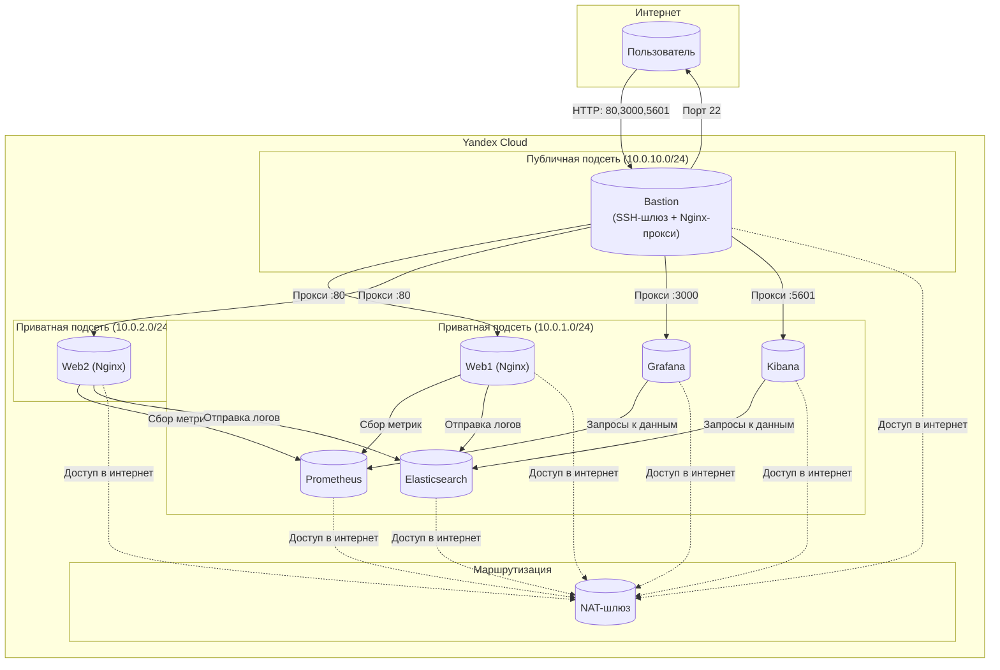

# Курсовая работа на профессии "DevOps-инженер с нуля" - Старцев Данила Антонович

## Содержание

1. [Задача](#задача)
2. [Инфраструктура](#инфраструктура)
   - [Сайт](#сайт)
   - [Мониторинг](#мониторинг)
   - [Логи](#логи)
   - [Сеть](#сеть)
   - [Резервное копирование](#резервное-копирование)
3. [Архитектура и принятые решения](#архитектура-и-принятые-решения)
   - [Сетевая структура и состав ВМ](#сетевая-структура-и-состав-вм)
   - [Сервисная модель](#сервисная-модель)
   - [Принятые компромиссы](#принятые-компромиссы)
4. [Используемые технологии](#используемые-технологии)
5. [Структура проекта](#структура-проекта)
6. [Визуальная архитектура проекта](#визуальная-архитектура-проекта)
7. [Развёртывание](#развёртывание)
8. [Доступ к сервисам](#доступ-к-сервисам)
9. [Выводы](#выводы)
10. [Полезные команды](#полезные-команды)

---

## Задача

Ключевая задача - разработать отказоустойчивую инфраструктуру для сайта, включающую мониторинг, сбор логов и резервное копирование основных данных. Инфраструктура размещается в Yandex Cloud.

Перед началом работы над курсовым заданием изучена [Инструкция по экономии облачных ресурсов](https://github.com/netology-code/devops-materials/blob/master/cloudwork.MD).

---

## Инфраструктура

Для развёртки инфраструктуры использованы **Terraform** и **Ansible**.

### Сайт

- Созданы две ВМ (`web1`, `web2`) в разных зонах доступности (`ru-central1-a`, `ru-central1-b`).
- На каждой ВМ развернут сервер Nginx в Docker-контейнере. ОС и содержимое ВМ идентичны.
- Использован набор статичных файлов для сайта.
- Балансировка нагрузки реализована с помощью Nginx на Bastion (вместо Application Load Balancer) для соблюдения квоты на публичные IP-адреса.
- Тестирование сайта выполнено через `curl -v http://<публичный IP Bastion>:80`.

### Мониторинг

- Создана ВМ (`prometheus`) для Prometheus.
- На каждой веб-ВМ установлены **Node Exporter** и **Nginx Log Exporter**.
- Prometheus настроен на сбор метрик с этих экспортеров.
- Создана ВМ (`grafana`) для Grafana.
- Grafana настроена на взаимодействие с Prometheus. Настроены дашборды с отображением метрик: Utilization, Saturation, Errors для CPU, RAM, дисков, сети, а также `http_response_count_total` и `http_response_size_bytes`. Добавлены необходимые пороговые значения (thresholds).

> **Скриншот дашборда Grafana:**  
> 
> 

### Логи

- Создана ВМ (`elasticsearch`) для Elasticsearch.
- На веб-серверах установлен Filebeat (в Docker-контейнере), настроена отправка access.log и error.log Nginx в Elasticsearch.
- Создана ВМ (`kibana`) для Kibana, сконфигурировано соединение с Elasticsearch.

> **Скриншот Kibana:**  
> 

### Сеть

- Развернут один VPC (`diplom-project-network`).
- Серверы web, Prometheus, Elasticsearch помещены в приватные подсети.
- Bastion является единственной точкой входа из интернета, поэтому он размещён в публичной подсети. Grafana и Kibana расположены  приватных подсетях, доступ к ним осуществляется через прокси на Bastion.
- Настроены Security Groups для соответствующих сервисов на входящий трафик только к нужным портам.
- Настроена ВМ с публичным адресом (`bastion`), в которой открыт только один порт — 22 (SSH). Все Security Groups настроены на разрешение входящего SSH из этой security group. Реализована концепция bastion host.

### Резервное копирование

- Вместо платных снапшотов Yandex Cloud реализован бесплатный бэкап через **rsync** на Bastion.
- Настроена ежедневная задача (cron) для копирования важных файлов (`/etc`, `/var/log`, `/opt`, `/home/ubuntu`) в каталог `/opt/backup`.
- Ограничено время жизни бэкапов до 7 дней (автоматическая очистка старых копий).
- Путь хранения: бэкапы всех ВМ сохраняются на Bastion-хосте в каталоге `/opt/backup/<имя_хоста>/<дата>/`. Символическая ссылка `latest` всегда указывает на последний успешный бэкап.
- Восстановление: для восстановления данных скопируйте нужные файлы из каталога бэкапа обратно на целевую ВМ, например:
  ```bash
  rsync -av /opt/backup/web1/latest/opt/nginx/ /opt/nginx/
  ```

> **Скриншот Резервного копирования:**  
> 
---

**Теперь рассмотрим архитектурные решения, которые легли в основу проекта**

## Архитектура и принятые решения

Визуальная схема взаимодействия компонентов системы представлена в разделе [Визуальная архитектура проекта](https://github.com/MindMaze74/diplom-project/blob/main/README.md#визуальная-архитектура-проекта).

### Сетевая структура и состав ВМ

- Создан один VPC с двумя зонами доступности.
- В каждой зоне имеются публичная подсеть (для Bastion) и приватная подсеть (для всех остальных сервисов).
- Для доступа в интернет из приватных подсетей настроен NAT-шлюз.
- Security Groups настроены по принципу минимально необходимых прав.

| Имя ВМ | Зона доступности | Роль | Публичный IP | Прерываемая |
|--------|------------------|------|--------------|-------------|
| `bastion` | `ru-central1-a` | SSH-шлюз, Nginx-прокси (балансировщик) | **Да** (единственный) | Да |
| `web1` | `ru-central1-a` | Веб-сервер (nginx в Docker) | Нет | Да |
| `web2` | `ru-central1-b` | Веб-сервер (nginx в Docker) | Нет | Да |
| `prometheus` | `ru-central1-a` | Сбор метрик (Prometheus в Docker) | Нет | Да |
| `grafana` | `ru-central1-a` | Визуализация (Grafana в Docker) | Нет | Да |
| `elasticsearch` | `ru-central1-a` | Хранилище логов (Elasticsearch в Docker) | Нет | Да |
| `kibana` | `ru-central1-a` | Просмотр логов (Kibana в Docker) | Нет | Да |

> **Примечание:** Все ВМ используют **прерываемые** инстансы (`preemptible = true`), что позволяет экономить до 70% стоимости аренды. Это допустимо для курсовой работы, так как инфраструктура не является критичной к перезапускам.

### Сервисная модель

- **Веб-серверы**: Nginx в Docker-контейнерах, балансировка через Nginx на Bastion.
- **Мониторинг**: Node Exporter и Nginx Log Exporter на веб-серверах; Prometheus собирает метрики; Grafana визуализирует их.
- **Логирование**: Filebeat (в Docker) на веб-серверах отправляет логи Nginx в Elasticsearch; Kibana предоставляет интерфейс для просмотра логов.
- **Резервное копирование**: Бесплатный бэкап через rsync на Bastion с хранением 7 дней.

### Принятые компромиссы

Любой реальный проект - это поиск баланса между «как правильно» и «как можно с учётом ресурсов». В этой работе мы столкнулись с несколькими ограничениями и сделали осознанный выбор в пользу практичности. Вот ключевые решения, которые определили итоговую архитектуру.

#### Только один публичный IP-адрес

При попытке развернуть Bastion, Grafana, Kibana и балансировщик с отдельными публичными IP мы быстро упёрлись в квоту Yandex Cloud: больше одного IP в минуту создать нельзя.Запрос на увеличение квоты отклонили это внутреннее ограничение платформы. Последовательное создание с паузами не помогало, а статические IP требовали ручного вмешательства и не решали проблему скорости.

В итоге мы оставили публичный IP только для Bastion, а все остальные сервисы спрятали в приватные подсети. Доступ к ним идёт через Nginx-прокси на Bastion. Так мы обошли квоту, сократили количество публичных точек входа и даже повысили безопасность. Минус - Grafana и Kibana теперь не доступны напрямую из интернета, но для внутренних сервисов это даже предпочтительнее.

#### Балансировка без управляемого ALB

По заданию нужна балансировка между веб-серверами. Можно было бы взять готовый Application Load Balancer от Yandex, но он требует отдельного публичного IP (мы уже решили, что лишних IP не будет) и стоит денег. Альтернативы - Network Load Balancer или HAProxy на отдельной ВМ - тоже не подходили.

Мы поставили Nginx на Bastion и сделали его одновременно и прокси, и балансировщиком. Он раздаёт трафик на два веб-сервера, а заодно проксирует запросы к Grafana и Kibana. Получилось централизованное решение без дополнительных затрат. Плата за это - мы сами отвечаем за его работу: обновления, мониторинг, отказоустойчивость. Но зато мы имеем полный контроль и понимание того, как всё устроено.

#### Grafana и Kibana - в приватных подсетях

Исходное задание предполагало, что эти сервисы будут видны из интернета напрямую. Но для этого им нужны собственные публичные IP, а их у нас нет. Поэтому мы разместили их в приватных подсетях и открыли доступ через Bastion (порты 3000 и 5601).

Функциональность не пострадала - все веб-интерфейсы доступны. При этом сервисы не светятся в интернете напрямую, что хорошо с точки зрения безопасности. Да, это отклонение от буквы задания, но оно обосновано и очень часто встречается на практике (reverse proxy для внутренних приложений).

#### Прерываемые ВМ для экономии

Облачные ресурсы стоят денег, а бюджет не резиновый. Мы могли бы взять обычные ВМ с гарантированной доступностью, но они дороже. Вместо этого мы выбрали прерываемые инстансы (`preemptible = true`) - они дают скидку до 70%.

Цена вопроса - такие ВМ могут быть остановлены в любой момент (максимум живут 24 часа). Но все наши сервисы упакованы в Docker с политикой `restart: always`, поэтому после остановки они автоматически поднимутся снова. Для проекта, где не требуется 24/7 доступность, это приемлемый компромисс.

#### Полная автоматизация SSH

Чтобы с Bastion можно было заходить на остальные ВМ, нужны SSH-ключи. Ручное копирование ключей на каждую машину это боль и источник ошибок.

Мы сделали так: Terraform при создании ВМ закладывает публичный ключ в метаданные (через `ssh-keys`). Затем Ansible дополнительно распространяет ключи внутри сети, чтобы Bastion мог подключаться ко всем хостам. В итоге доступ работает из коробки, без лишних телодвижений. Единственное условие - на Bastion ключ должен оказаться на этапе развёртывания, но это мы решили на уровне Terraform.

#### Без managed-сервисов

Yandex предлагает готовые решения - Managed Databases, Managed Kubernetes и т.д. Они сильно упрощают жизнь, но стоят дополнительных денег и требуют изучения новых интерфейсов.

Мы решили, что для нашей задачи проще и дешевле развернуть всё в Docker на собственных ВМ. Prometheus, Grafana, Elasticsearch, Kibana - все работают в контейнерах, управление через Ansible. У нас полный доступ к конфигам, легко отлаживать, и мы не привязаны к конкретному облачному вендору.

Разумеется, у этого подхода есть обратная сторона: нет автоматического масштабирования, нет встроенного failover, и мы не гарантируем 99.9% доступности. Если нагрузка вырастет, придётся вручную увеличивать ресурсы ВМ. Если ВМ упадёт, сервис ляжет до ручного вмешательства (или до перезапуска Docker). Но для проектов, где важна демонстрация, а не промышленная надёжность, это оправданно.

#### Docker вместо нативной установки: воспроизводимость ценой производительности

Нативная установка сервисов (через apt или сборка из исходников) даёт максимальную производительность, но требует ручного управления зависимостями и усложняет обновления. Docker-контейнеры обеспечивают единообразие окружений и простоту переноса, но добавляют дополнительные затраты ресурсов.

Мы выбрали Docker как стандартный инструмент для современных проектов. Это позволило унифицировать развёртывание и упростить управление версиями. Дополнительные затраты ресурсов не критичны для целей проекта.

---

**Для реализации поставленных задач был выбран следующий стек инструментов**

## Используемые технологии

| Технология / Компонент | Назначение | Примечание |
|------------------------|------------|------------|
| **Terraform** | Создание инфраструктуры (сети, ВМ, Security Groups). | Аутентификация через сервисный аккаунт с постоянным ключом (`service_account_key_file`). |
| **Ansible** | Настройка ВМ: установка Docker, запуск контейнеров, настройка экспортеров, Filebeat, сервисов мониторинга и логирования. | Используется динамический инвентарь, генерируемый Terraform. |
| **Docker** | Контейнеризация всех сервисов. | Изолирует и упрощает развёртывание приложений. |
| **Yandex Cloud CLI** | Создание сервисного аккаунта и авторизованного ключа, диагностика ресурсов. | Используется для ручных проверок и создания ключей. |
| **Git** | Управление версиями кода. | Репозиторий на GitHub: [MindMaze74/diplom-project](https://github.com/MindMaze74/diplom-project). |

| Технология | Версия / Комментарий |
|------------|----------------------|
| Terraform | >= 1.0 |
| Ansible | >= 2.9 |
| Docker | 29.6.0 |
| Nginx | 1.31 (в официальном образе) |
| Prometheus | 3.5.4 |
| Grafana | 10.x |
| Elasticsearch | 8.17.0 |
| Kibana | 8.17.0 |
| Filebeat | 7.17.25 |
| Node Exporter | 1.8.2 |
| prometheus-nginxlog-exporter | 1.9.2 |

### Стек сервисов (запущены в Docker)

| Сервис | Роль |
|--------|------|
| **Nginx (на Bastion)** | Балансировщик и прокси для сайта, Grafana и Kibana (единственная точка входа). |
| **Nginx (на web-серверах)** | Веб-сервер для статического сайта. |
| **Node Exporter** | Сбор системных метрик с веб-серверов для Prometheus. |
| **Nginx Log Exporter** | Сбор метрик доступа Nginx для Prometheus. |
| **Prometheus** | Сбор и хранение метрик мониторинга. |
| **Grafana** | Визуализация метрик (дашборды). |
| **Elasticsearch** | Хранилище логов от Filebeat. |
| **Kibana** | Просмотр и анализ логов. |
| **Filebeat** | Сбор и отправка логов Nginx в Elasticsearch (запущен в Docker-контейнере). |

### Дополнительные инструменты

| Инструмент | Назначение |
|------------|------------|
| **Rsync** | Бесплатное резервное копирование важных файлов (ежедневно, хранение 7 дней). |
| **Cron** | Планировщик для автоматического запуска бэкапа. |


---

## Структура проекта

```bash
diplom-project
├── ansible
│   ├── ansible.cfg
│   ├── files
│   │   └── dashboards
│   │       ├── nginx_dashboard.json
│   │       └── node_exporter_full.json
│   ├── inventory
│   │   └── inventory.ini
│   └── playbooks
│       ├── backup.yml
│       ├── import_dashboards.yml
│       ├── setup_bastion.yml
│       ├── setup_elasticsearch.yml
│       ├── setup_grafana.yml
│       ├── setup_kibana.yml
│       ├── setup_monitoring.yml
│       ├── setup_prometheus.yml
│       ├── setup_ssh_keys.yml
│       ├── setup_web_servers.yml
│       └── site.yml
├── img
│   ├── 1.png
│   ├── 2.png
│   ├── 3.png
│   ├── 4.png
│   ├── img15.png
│   ├── img16.png
│   ├── img17.png
│   ├── img18.png
│   ├── img19.png
│   └── img20.png
├── md-instruction.md
├── README.md
├── screen-instruction.md
└── terraform
    ├── bastion-cloud-init.yml
    ├── bastion.tf
    ├── instances.tf
    ├── network.tf
    ├── outputs.tf
    ├── provider.tf
    ├── security-groups.tf
    ├── templates
    │   ├── bastion-cloud-init.yml.tpl
    │   ├── cloud-init.yml.tpl
    │   └── inventory.tpl
    ├── terraform.tfstate
    ├── terraform.tfstate.backup
    ├── terraform.tfvars
    ├── terraform.tfvars.example
    ├── timeouts.tf
    └── variables.tf
```


---

## Визуальная архитектура проекта

На схеме ниже показано взаимодействие компонентов системы:

- **Сплошные стрелки** — прямой сетевой трафик между сервисами.
- **Пунктирные стрелки** — выход в интернет через NAT-шлюз.
- **Цифры** — номера портов для каждого соединения.




## Развёртывание

### Предварительные требования

- **Активный платёжный аккаунт** в Yandex Cloud с достаточным балансом.
- **Установленные инструменты**:
-   Terraform (>= 1.0) — [инструкция по установке](https://developer.hashicorp.com/terraform/tutorials/aws-get-started/install-cli)
-   Ansible (>= 2.9) — [инструкция по установке](https://docs.ansible.com/projects/ansible/latest/installation_guide/intro_installation.html)
-   Yandex Cloud CLI — [инструкция по установке](https://yandex.cloud/ru/docs/cli/operations/install-cli?utm_referrer=about%3Ablank)
- **Настроенный профиль Yandex Cloud CLI** — выполните `yc init` и авторизуйтесь.
- **Права доступа** — ваш аккаунт должен иметь роль `editor` или выше в каталоге.
- **Сервисный аккаунт** с авторизованным ключом (путь указывается в `terraform.tfvars`).
- **SSH-ключи** на локальной машине (`~/.ssh/diplom` и `~/.ssh/diplom.pub`).

### Шаги по развёртыванию

1.  **Клонировать репозиторий**:
    ```bash
    git clone https://github.com/MindMaze74/diplom-project.git
    cd diplom-project
    ```

2.  **Настроить переменные Terraform**:
    ```bash
    cd terraform
    cp terraform.tfvars.example terraform.tfvars
    ```
   >Отредактируйте файл terraform.tfvars, указав свои данные (ID облака, каталога, пути к ключам).

3.  **Проверить версии инструментов (рекомендуется)**:
    ```bash
    terraform --version
    ansible --version
    yc --version
    ```
4.  **Развернуть инфраструктуру**:
    ```bash
    terraform init
    terraform apply -parallelism=1
    ```
   > Дождитесь завершения (около 10–15 минут). При появлении запроса подтвердите действие вводом yes
   > Примечание: Параметр -parallelism=1 ограничивает параллельность для обхода квоты на создание публичных IP-адресов.

5.  **Проверить созданные ресурсы**:
    ```bash
    terraform state list
    terraform output
    ```
6.  **Настроить сервисы через Ansible**:
     ```bash
    cd ../ansible
    ansible-playbook -i inventory/inventory.ini playbooks/site.yml
    ```
    >Это займёт ещё 5–10 минут.

7.  **Проверить логи Ansible (если возникли ошибки)**:
    ```bash
    ansible-playbook -i inventory/inventory.ini playbooks/site.yml -vvv
    ```
8.  **Проверить доступность сервисов (см. раздел Доступ к сервисам).**

9.  **Проверка Elasticsearch**
    ```bash
    curl -s http://10.0.1.3:9200/_cluster/health | jq .
    ```
10. **Проверка Kibana**
    ```bash
    curl -s http://10.0.1.16:5601/api/status | jq .
    ```
### Health Checks

Для быстрой проверки состояния всех сервисов выполните на соответствующих ВМ:

| Сервис | Команда проверки |
|--------|-------------------|
| Nginx | `curl -s http://localhost/ \| head -5` |
| Node Exporter | `curl -s http://localhost:9100/metrics \| head -5` |
| Nginx Log Exporter | `curl -s http://localhost:4040/metrics \| grep nginx_http` |
| Prometheus | `curl -s http://localhost:9090/api/v1/query?query=up` |
| Grafana | `curl -s http://localhost:3000/api/health` |
| Elasticsearch | `curl -s http://localhost:9200/_cluster/health` |
| Kibana | `curl -s http://localhost:5601/api/status` |
| Filebeat | `docker logs filebeat --tail 10` (на каждом веб-сервере) |

#### Доступ к сервисам

| Сервис | URL | Логин/Пароль |
|--------|-----|--------------|
| **Сайт** | `http://93.77.177.69/` | – |
| **Grafana** | `http://93.77.177.69:3000/login` | `admin` / `admin` |
| **Kibana** | `http://93.77.177.69:5601` | – (без аутентификации) |
>Важно:
>Доступ осуществляется по протоколу HTTP (HTTPS не настроен).
> Публичный IP Bastion можно получить командой:
> ```bash
> cd terraform
> terraform output bastion_public_ip
> ```
>Kibana может быть недоступна в течение первых 2–3 минут после запуска, так как ей требуется время для инициализации.

**В итоге можно подвести следующие итоги**

## Выводы
В результате работы спроектирована и реализована полностью автоматизированная инфраструктура, в полной мере отражающая все ключевые практики, изученные в рамках курса:

- **Infrastructure as Code (Terraform)** – все облачные ресурсы (ВМ, сети, группы безопасности) описаны декларативно и воспроизводимы.
- **Управление конфигурацией (Ansible)** – настройка всех серверов автоматизирована, исключены ручные операции.
- **Контейнеризация (Docker)** – все сервисы (Nginx, Prometheus, Grafana, ELK, Filebeat) запущены в изолированных контейнерах, что упрощает обновление и масштабирование.
- **Мониторинг (Prometheus + Grafana)** – реализован сбор системных метрик (Node Exporter) и метрик прикладного уровня (Nginx Log Exporter), построены информативные дашборды.
- **Централизованное логирование (ELK + Filebeat)** – логи Nginx агрегируются и визуализируются в Kibana, с корректным отображением источника (host.name).
- **Безопасность** – доступ к внутренней сети организован через bastion-хост с единственным публичным IP, настроены сегментированные группы безопасности.
- **Отказоустойчивость** – развёрнуты два веб-сервера, что обеспечивает базовую избыточность.
- **Наблюдаемость (Observability)** – реализован полный цикл сбора метрик и логов, что позволяет оперативно диагностировать состояние системы.

Принятые компромиссы (один публичный IP, прокси через Bastion, прерываемые ВМ, отказ от управляемых сервисов) являются разумными и обоснованными в условиях облачных квот и ограниченного бюджета.

Инфраструктура готова к масштабированию: добавление новых веб-серверов или увеличение ресурсов ВМ не требует изменения архитектуры. Проект может служить основой для более сложных решений с использованием Managed Kubernetes, Managed Databases и других сервисов Yandex Cloud.

## Полезные команды

### Terraform

```bash
# Инициализация проекта
terraform init

# Проверка синтаксиса и форматирование
terraform validate
terraform fmt

# Просмотр плана изменений
terraform plan

# Развёртывание инфраструктуры (с ограничением параллельности)
terraform apply -parallelism=1

# Удаление всей инфраструктуры
terraform destroy -parallelism=1

# Получение выходных данных (IP-адреса)
terraform output bastion_public_ip
terraform output web_private_ips
```

### Ansible
```bash
# Проверка синтаксиса плейбука
ansible-playbook --syntax-check playbooks/site.yml

# Запуск основного плейбука
ansible-playbook -i inventory/inventory.ini playbooks/site.yml

# Запуск конкретного плейбука (например, только для веб-серверов)
ansible-playbook -i inventory/inventory.ini playbooks/setup_web_servers.yml --limit web1,web2

# Запуск с тегом (например, только Docker)
ansible-playbook -i inventory/inventory.ini playbooks/site.yml --tags docker

# Просмотр инвентаря
ansible-inventory -i inventory/inventory.ini --list

# Отладка с подробным выводом
ansible-playbook -i inventory/inventory.ini playbooks/site.yml -vvv
```

### Yandex Cloud CLI
```bash
# Создание сервисного аккаунта
yc iam service-account create --name diplom-sa

# Создание авторизованного ключа
yc iam key create --service-account-name diplom-sa --output ~/diplom-sa-key.json

# Назначение роли editor на каталог
yc resource-manager folder add-access-binding \
  --id <ваш_folder_id> \
  --role editor \
  --service-account-name diplom-sa

# Список всех ресурсов в каталоге (ВМ, сети, диски)
yc compute instance list --folder-id <ваш_folder_id>
yc vpc network list --folder-id <ваш_folder_id>
yc compute disk list --folder-id <ваш_folder_id>

# Список публичных IP-адресов
yc vpc address list --folder-id <ваш_folder_id>
```

### Docker (на ВМ)
```bash
# Просмотр всех запущенных контейнеров
docker ps

# Просмотр всех контейнеров (включая остановленные)
docker ps -a

# Логи контейнера (например, Kibana)
docker logs kibana --tail 50

# Перезапуск контейнера
docker restart elasticsearch

# Остановка и удаление контейнера
docker stop kibana && docker rm kibana

# Запуск контейнера с нужными переменными окружения
docker run -d \
  --name kibana \
  --restart always \
  -p 5601:5601 \
  -e ELASTICSEARCH_HOSTS='["http://<elasticsearch_private_ip>:9200"]' \
  docker.elastic.co/kibana/kibana:8.17.0
```

### Проверка работоспособности
```bash
# Проверка сайта через Bastion
curl -v http://<bastion_public_ip>:80

# Проверка Grafana
curl -v http://<bastion_public_ip>:3000

# Проверка Kibana
curl -v http://<bastion_public_ip>:5601

# Проверка Elasticsearch (внутренний доступ)
curl http://<elasticsearch_private_ip>:9200

# Проверка метрик Nginx Log Exporter
curl http://<web1_private_ip>:4040/metrics | grep nginx_http

# Проверка индексов в Elasticsearch (логи)
curl http://<elasticsearch_private_ip>:9200/_cat/indices
```

### Диагностика SSH-доступа через Bastion
```bash
# Подключение к Bastion
ssh -i ~/.ssh/diplom ubuntu@<bastion_public_ip>

# Проверка доступа к web1
ssh -i ~/.ssh/diplom ubuntu@<web1_private_ip> "hostname"

# Копирование SSH-ключа на все ВМ
ssh-copy-id -i ~/.ssh/diplom.pub ubuntu@<web1_private_ip>
```

### Резервное копирование (rsync)
```bash
# Ручной запуск бэкапа
sudo /usr/local/bin/backup.sh

# Просмотр созданных бэкапов
ls -la /opt/backup/$(hostname)/

# Просмотр логов бэкапа
sudo tail -f /var/log/backup.log
```

### Git
```bash
# Клонирование репозитория
git clone https://github.com/MindMaze74/diplom-project.git

# Статус изменений
git status

# Добавление всех изменений
git add .

# Коммит с сообщением
git commit -m "Описание изменений"

# Отправка в удалённый репозиторий
git push origin main
```